# Gestor de Comunidades

Sistema de gestión para edificios residenciales desarrollado como proyecto de portafolio en Data Analytics.

> *Desarrollado con asistencia de Claude (Anthropic) para generación y depuración de código.*

## Descripción

Aplicación web construida con **R/Shiny** conectada a una base de datos **PostgreSQL**, diseñada para digitalizar y centralizar la administración de un edificio residencial. El proyecto abarca desde el diseño del modelo relacional hasta el desarrollo de un dashboard interactivo con control de acceso por roles.

El proyecto nace de la experiencia real en conserjería, identificando las necesidades operativas de un edificio: control de encomiendas, registro de turnos, gestión financiera y administración de residentes.

## Capturas de pantalla

### Login
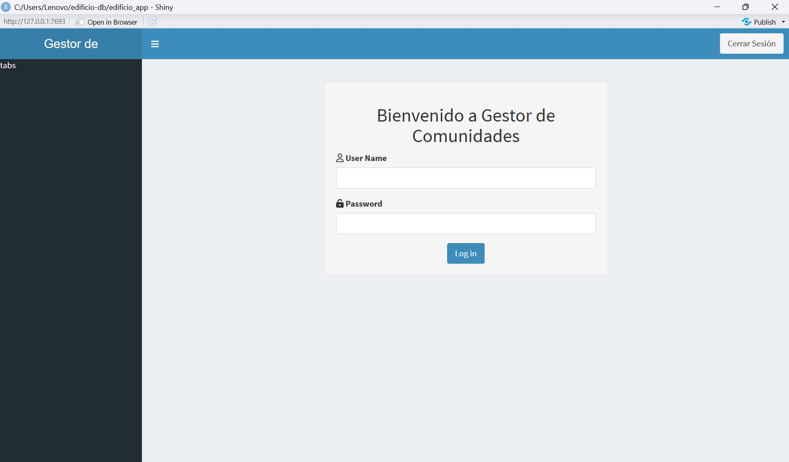

### Resumen General (Administrador)
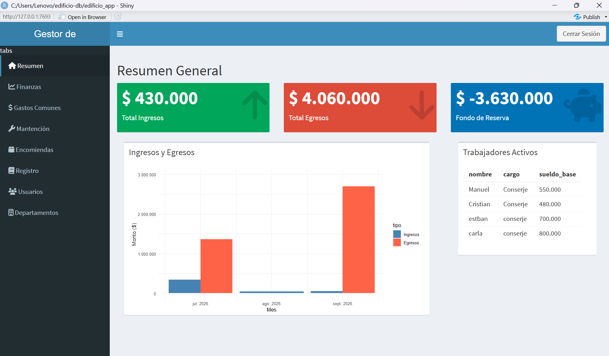

### Finanzas - Ingresos
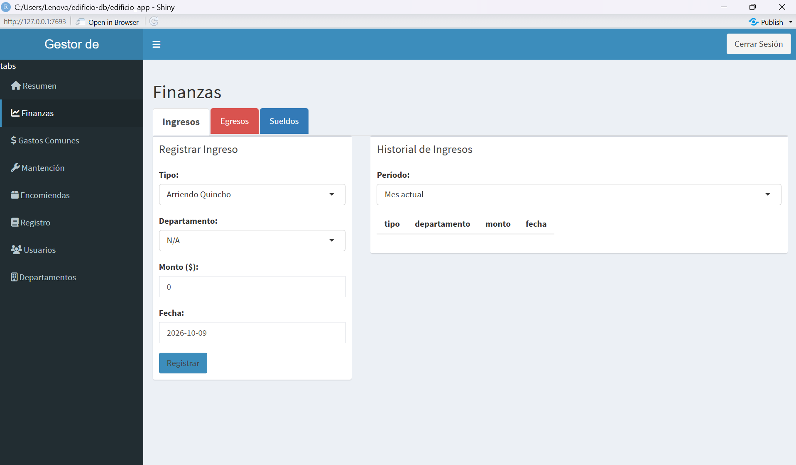

### Finanzas - Egresos
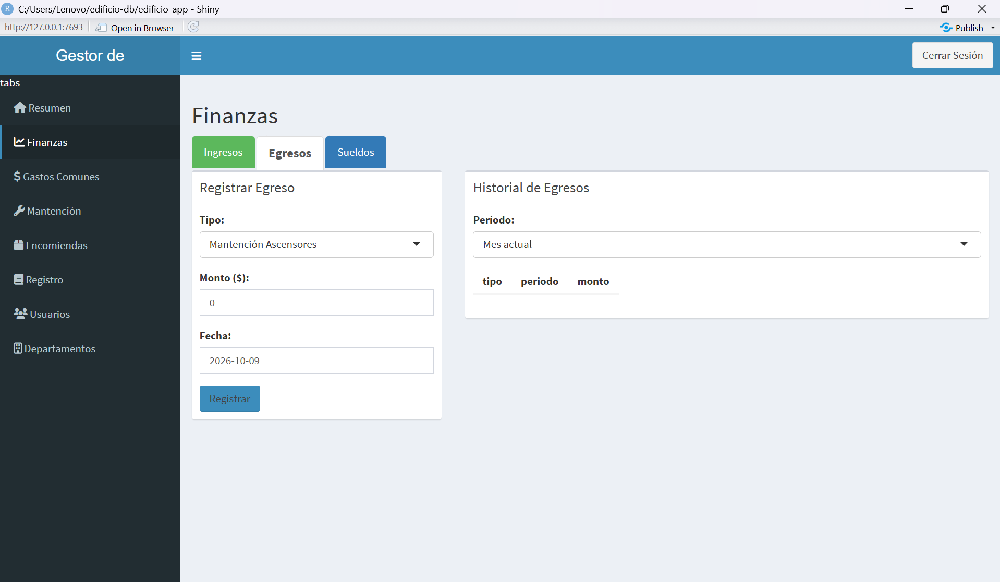

### Finanzas - Sueldos
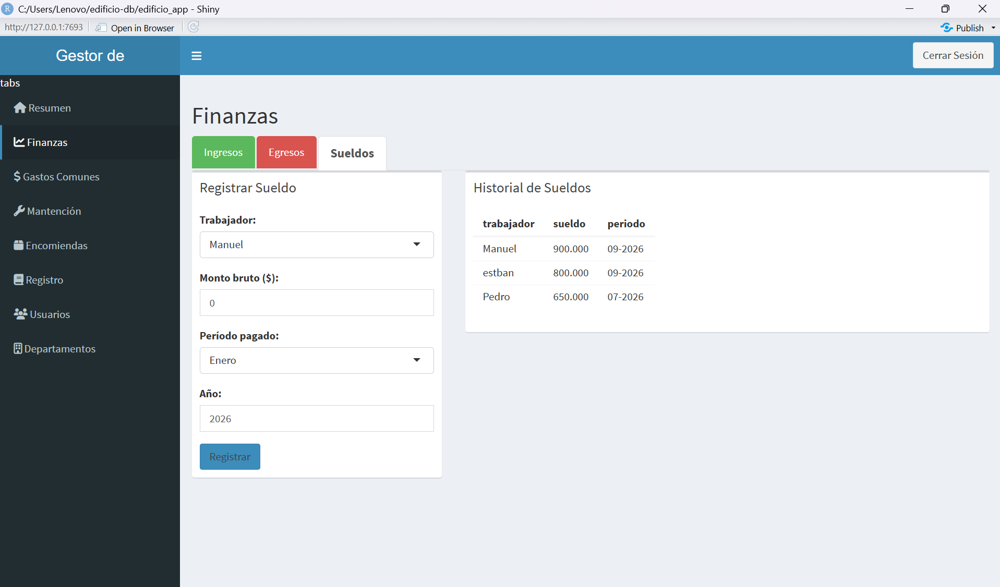

### Gastos Comunes
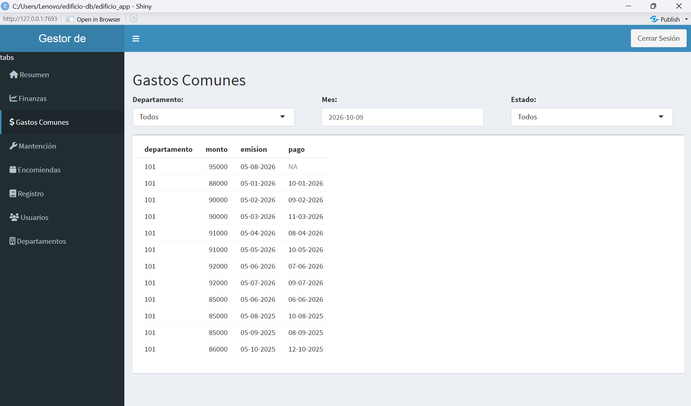

### Mantención (Administrador)
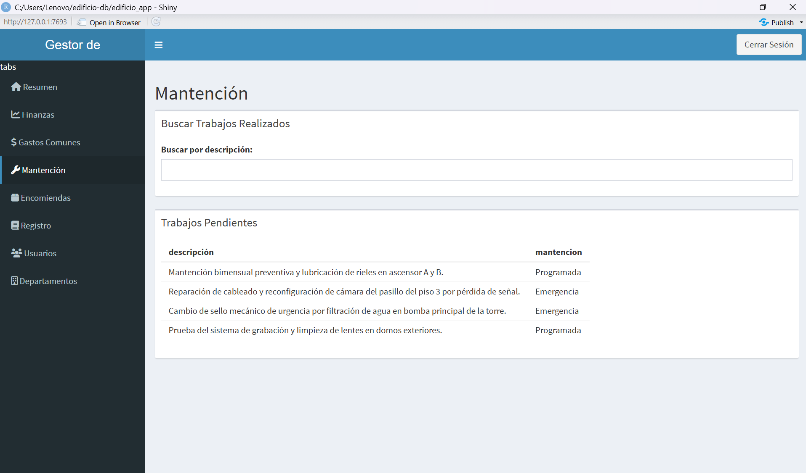

### Encomiendas (Administrador)


### Registro de Turno
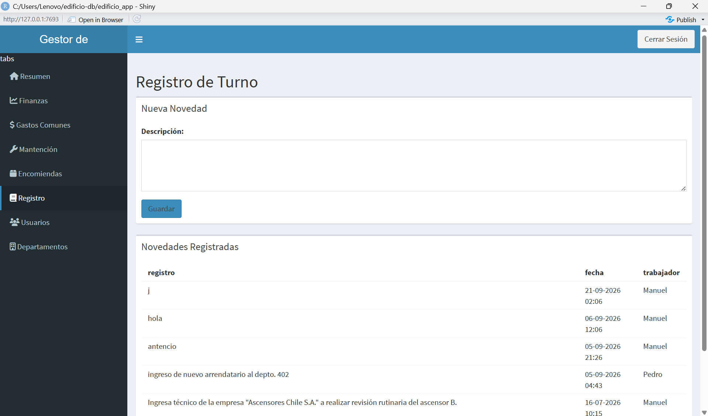

### Administración - Usuarios
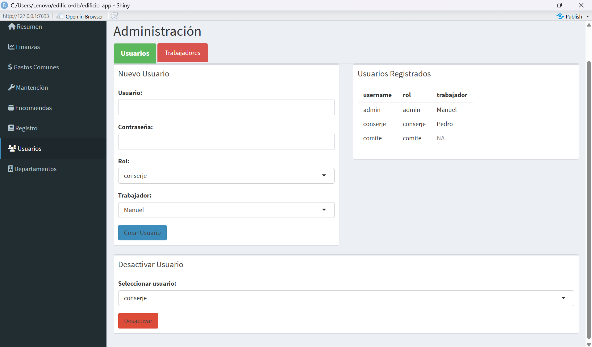

### Administración - Trabajadores
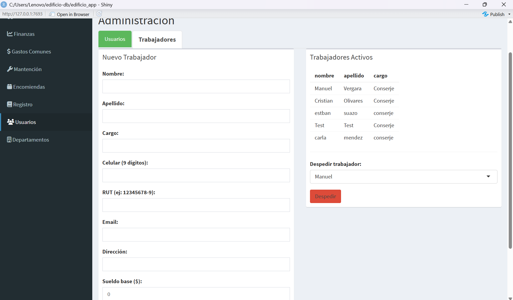

### Departamentos - Vista General
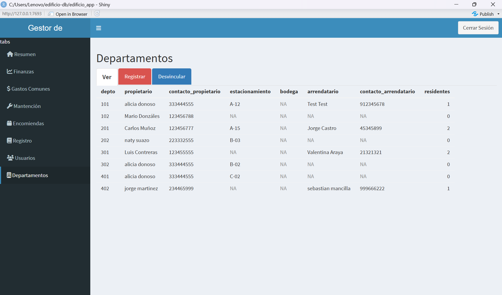

### Departamentos - Registro
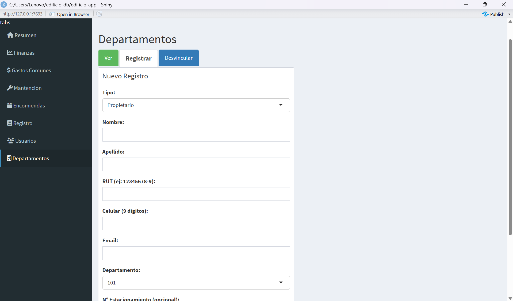

### Departamentos - Desvincular
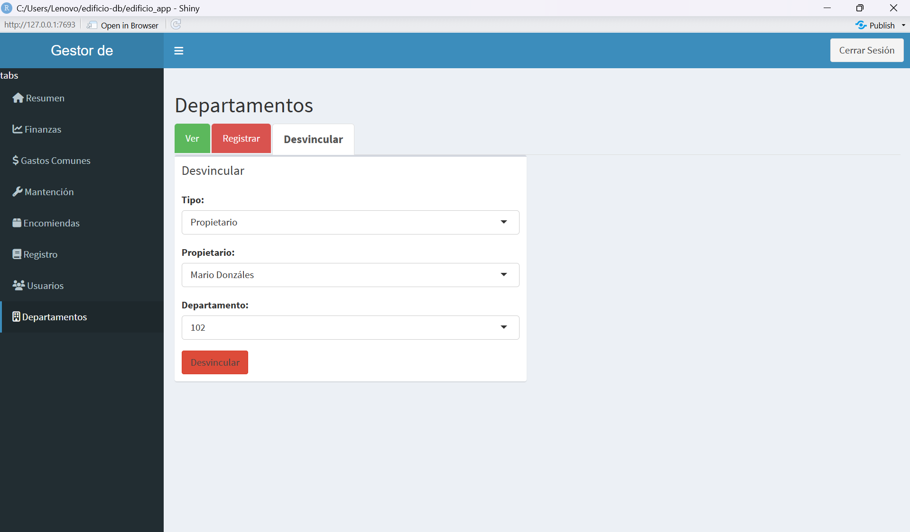

### Vista Conserje - Registro de Turno
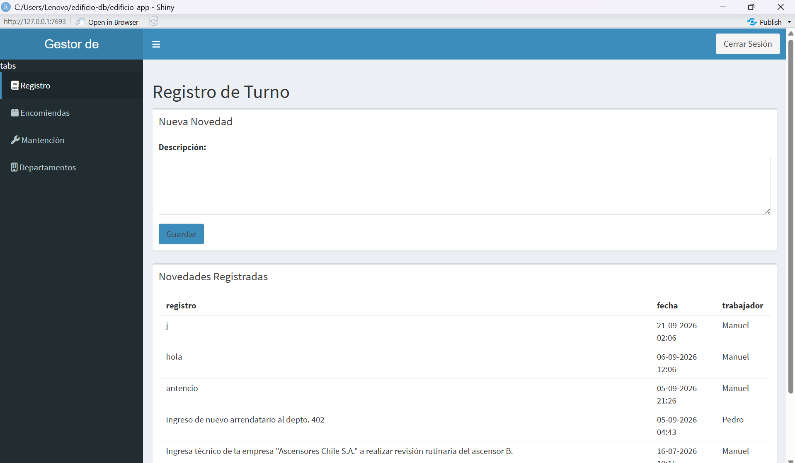

### Vista Conserje - Encomiendas
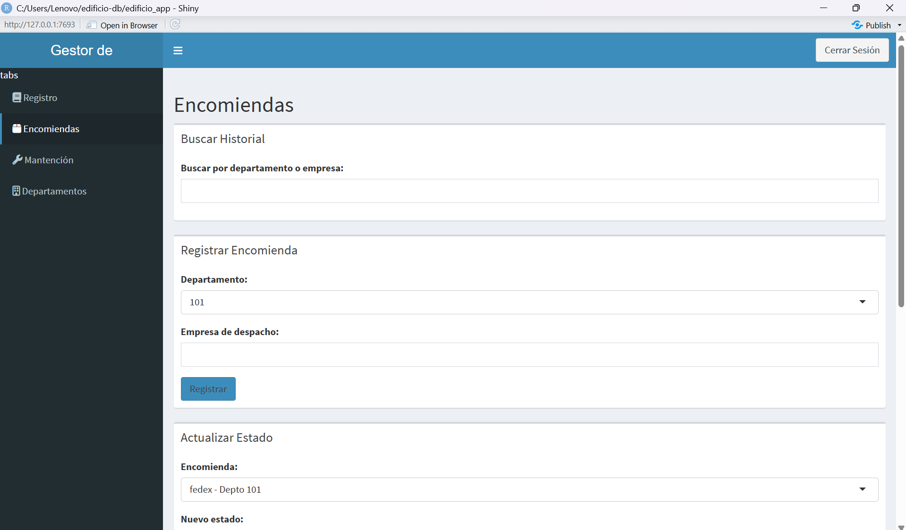

### Vista Conserje - Mantención


### Vista Conserje - Departamentos
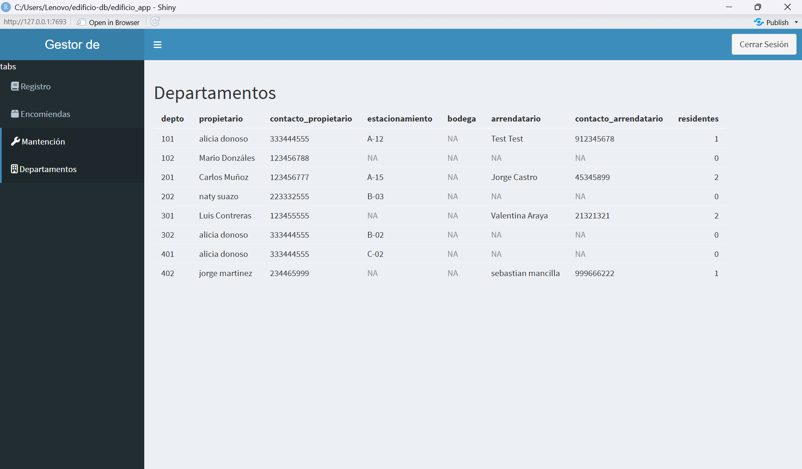

## Tecnologías

- **Base de datos:** PostgreSQL 16
- **Lenguaje:** R
- **Dashboard:** Shiny + shinydashboard
- **Autenticación:** shinyauthr + sodium (contraseñas hasheadas)
- **Visualización:** ggplot2, DT
- **Control de versiones:** Git / GitHub

## Funcionalidades

### Por rol de usuario

**Administrador**
- Resumen financiero con KPIs (ingresos, egresos, fondo de reserva)
- Gráfico de ingresos y egresos por mes
- Registro y seguimiento de gastos comunes por departamento
- Gestión de mantenciones (trabajos pendientes e historial)
- Control de encomiendas con alerta visual por días guardados
- Registro de novedades de turno
- Administración de usuarios y trabajadores
- Gestión de departamentos (propietarios, arrendatarios, residentes)
- Finanzas: ingresos, egresos y sueldos con historial por período

**Conserje**
- Registro de novedades de turno
- Control de encomiendas (recibir, mover a bodega, entregar)
- Mantención: trabajos pendientes y buscador
- Vista de departamentos

**Comité**
- Acceso de solo lectura a todas las secciones

### Base de datos
- 20+ tablas relacionales normalizadas
- VIEWs para consultas frecuentes
- TRIGGERs para automatización (morosidad, desvinculación de trabajadores y residentes)
- CHECK constraints para validación de datos
- Historial de propietarios por departamento

## Estructura del repositorio

```
edificio-db/
├── app.R                  # Aplicación Shiny completa
├── edificio_db.sql        # Script de creación de la base de datos
├── screenshots/           # Capturas de pantalla del dashboard
└── README.md
```

## Instalación y uso

### Requisitos
- PostgreSQL 16
- R 4.x
- RStudio (recomendado)

### Paquetes R necesarios
```r
install.packages(c("shiny", "shinydashboard", "DBI", "RPostgres",
                   "ggplot2", "scales", "DT", "shinyauthr",
                   "shinyjs", "sodium"))
```

### Pasos
1. Clonar el repositorio:
```bash
git clone https://github.com/Jorge-Martinez-1984/edificio-db.git
```

2. Crear la base de datos en PostgreSQL y ejecutar el script:
```bash
psql -U postgres -c "CREATE DATABASE edificio_db;"
psql -U postgres -d edificio_db -f edificio_db.sql
```

3. Configurar la conexión en `app.R` (usuario y contraseña de PostgreSQL).

4. Crear el primer usuario administrador desde la consola de R:
```r
library(sodium)
sodium::password_store("tu_contraseña")
# Insertar el hash en la tabla USUARIOS con rol = 'admin'
```

5. Ejecutar la app desde RStudio con el botón **Run App**.

## Modelo de datos

El diseño sigue principios de normalización (3FN) con separación de datos públicos y confidenciales. Las tablas más relevantes:

- `DEPARTAMENTOS` — información base de cada unidad
- `HISTORIAL_PROPIETARIO` — registro histórico de dueños por depto
- `TITULAR` / `RESIDENTES` — arrendatarios y miembros del hogar
- `GASTOS_COMUNES` — control de pagos mensuales por depto
- `HISTORIAL_ENCOMIENDA` — trazabilidad de paquetes
- `INGRESOS` / `EGRESOS` — contabilidad del edificio
- `USUARIOS` — credenciales con contraseñas hasheadas

## Mejoras futuras

- Despliegue en servidor web (shinyapps.io + PostgreSQL en la nube) para acceso remoto y escalabilidad a múltiples edificios
- Respaldo de comprobantes (imágenes de boletas/facturas) en almacenamiento cloud
- Módulo de mensajería masiva por email a propietarios y arrendatarios
- Automatización de generación mensual de gastos comunes (pg_cron)
- Diseño responsive para dispositivos móviles
- Gestión de roles personalizable desde la interfaz

## Autor

**Jorge Martinez**
Conserjería / Transición a Data Analytics
Viña del Mar, Chile
GitHub: [Jorge-Martinez-1984](https://github.com/Jorge-Martinez-1984)
